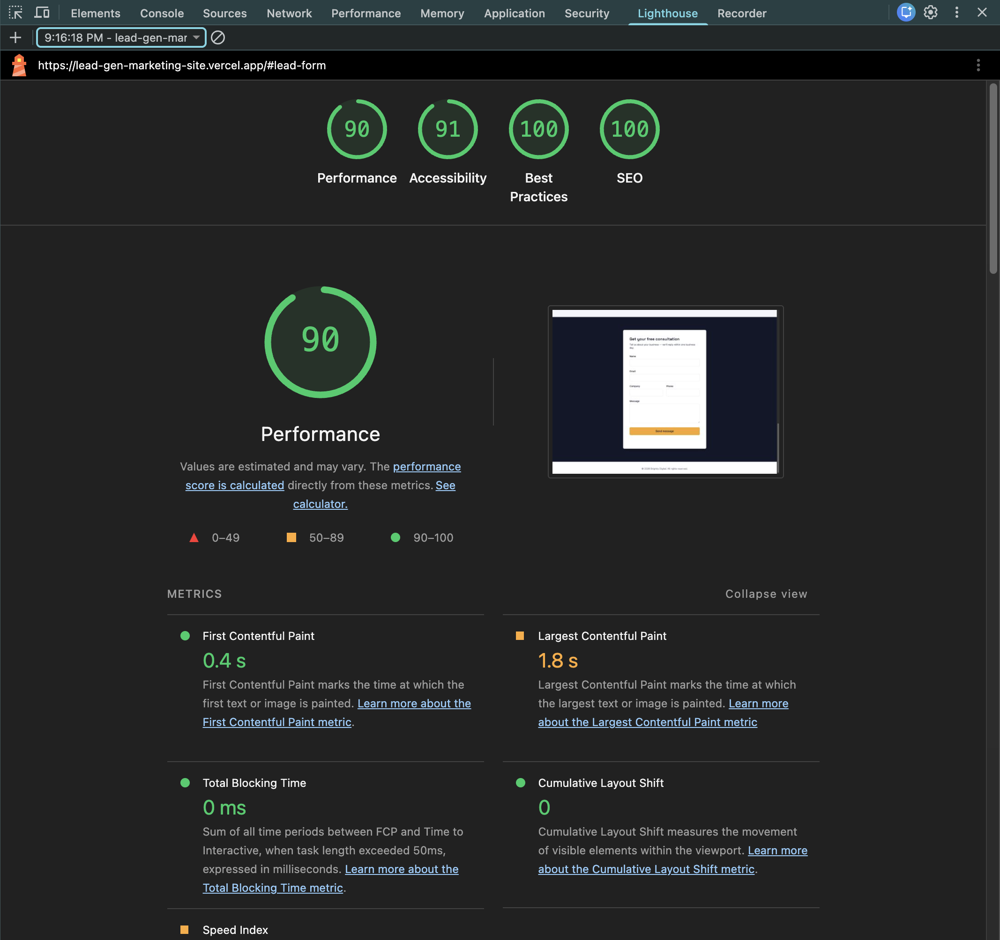

# Frontend

Vite + React + TypeScript marketing landing page with the lead-generation form and all tracking logic.

## Setup

```bash
npm install
cp .env.example .env
npm run dev
```

Runs on `http://localhost:5173`. The backend must also be running for the form to work.

### Environment Variables

| Variable       | Purpose                     |
| -------------- | ---------------------------- |
| `VITE_API_URL` | Base URL of the backend API |

## Folder Structure

```
src/
├── components/
│   ├── layout/       # Navbar, Footer
│   ├── sections/      # Hero, Services, Testimonials, Pricing, LeadForm
│   └── ui/            # FormStatus and other small reusable primitives
├── pages/             # LandingPage, ThankYou, NotFound
├── hooks/
├── lib/
│   ├── validation.ts  # zod schema, mirrors the backend's
│   ├── api.ts         # fetch wrapper for POST /api/lead
│   └── tracking.ts    # single source of truth for all tracking calls
├── store/
│   └── leadStore.ts   # Zustand: hasSubmitted flag
├── types/
├── router.tsx
└── App.tsx
```

## Routing

`react-router-dom`'s `createBrowserRouter`, with every route lazy-loaded via `React.lazy` + `Suspense`:

- `/` → `LandingPage`
- `/thank-you` → `ThankYou`
- `*` → `NotFound`

Each route ships as its own code-split JS chunk, verifiable in DevTools' Network tab.

## Lead Form

`LeadForm.tsx` uses `react-hook-form` with a `zodResolver`, validating against the same field rules as the backend (name, email, company, phone, message). Every input has `aria-invalid` and `aria-describedby` wired to its error message for screen-reader support. The submit button disables during submission as the first layer of duplicate-submission prevention (the backend's rate limiter is the second).

Four UI states are handled explicitly: idle, loading, success, error — each with a distinct, user-facing message via the `FormStatus` component.

## Tracking Implementation

All tracking calls go through `lib/tracking.ts` — no component calls `dataLayer.push` or `fbq` directly.

| Function                              | Fires                            | Trigger point                                               |
| -------------------------------------- | --------------------------------- | -------------------------------------------------------------- |
| `trackPageView()`                     | `page_view`                      | `LandingPage` mount (`useEffect`)                            |
| `trackCtaClick()`                     | `cta_click`                      | Navbar CTA `onClick`                                         |
| `trackFormStart()`                    | `form_start`                     | First field `onFocus` in `LeadForm` (fires once)              |
| `trackFormSubmitted()`                | `form_submitted` + Meta `Lead`   | Only inside `result.success` branch of the submit handler     |
| `trackFormSubmissionFailure(reason)`  | `form_submission_failure`        | Validation error, 429, 502, or network error                  |

**The conversion event is structurally prevented from firing on click alone** — `trackFormSubmitted()` is the only function that calls `fbq('track', 'Lead')`, and it's only reachable after the backend confirms success.

GTM (`GTM-XXXXXXX`) and Meta Pixel (`123456789012345`) use placeholder IDs, since no real ad accounts exist for this assessment. Verified via:

- Browser console — inspecting `window.dataLayer` after each action
- **Meta Pixel Helper** extension — confirming the `Lead` event fires only after a genuinely successful submission, not on an invalid one

## SEO / Metadata

`react-helmet-async` provides per-route `<title>`, description, and Open Graph tags (`LandingPage`, `ThankYou`, `NotFound` each set their own). `index.html` retains a fallback title/viewport for pre-hydration.

## Performance

- Route-level code splitting (`React.lazy` + `Suspense`)
- Images use `loading="lazy"` where applicable
- No third-party scripts beyond the two required for tracking (GTM, Meta Pixel)

## Known Limitation

Safari occasionally doesn't fire the input `change` event on autofill, meaning `react-hook-form` may not register an autofilled value until the field receives a manual interaction. Not addressed further given assessment scope — noted in the root README's Assumptions section.

## Performance Results

Tested with Lighthouse (Chrome DevTools, Mobile) against the deployed site.

| Category       | Score      |
| --------------- | ----------- |
| Performance     | __ / 100    |
| Accessibility   | __ / 100    |
| Best Practices  | __ / 100    |
| SEO             | __ / 100    |


